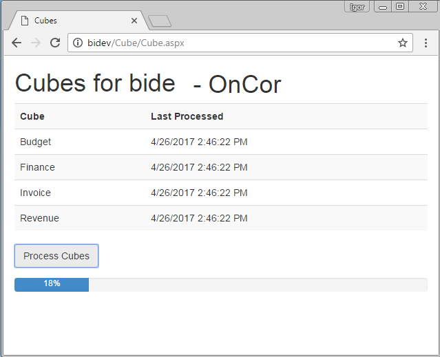

# ASP.NET Page to Process SSAS Cubes

Originally posted here:
https://www.codeproject.com/Articles/1184297/ASP-NET-Page-to-Process-SSAS-Cubes

ASP.NET page that lets you process an SSAS (SQL Server Analysis Services) cube database.

Introduction
SQL Server Analysis Services is usually processed daily, but sometimes, you want to give your users the ability to refresh the database on demand. This page lets you do that.

If there are any problems during the processing, the page will show you the error text.

## Installation

1. Unzip and copy to C:\inetpub\wwwroot\Cube
2. Open Cube.aspx.vb in Notepad. Change lines 4 and 5 to your server and SSAS database.
3. Open Cube.aspx in Notepad. Change Line 14 to the time estimate it takes to process your SSAS database.
4. Point your browser to http://YourServerName/Cube/Cube.aspx.

## Background

This page uses the following third party components:

1. ADOMD.NET (Microsoft.AnalysisServices.AdomdClient.dll)
2. AMO (Analysis Services Management Objects) (Microsoft.AnalysisServices.DLL)
3. jQuery
4. Bootstrap

## Using the Code

The Cube.aspx will let you process the cube asynchronously by using jQuery's $.get.

The Cube.aspx.vb code behind page will list cubes and their last processed time. Line 27 "oDatabase.Process(Microsoft.AnalysisServices.ProcessType.ProcessFull)" does the actual work of processing the database.

## Other Things to Try
Instead of using Database.Process(Microsoft.AnalysisServices.ProcessType.ProcessFull), we can try to run XMLA script using oServer.Execute(). 
This would give us greater flexibility like the ability to ignore KeyNotFound errors.
